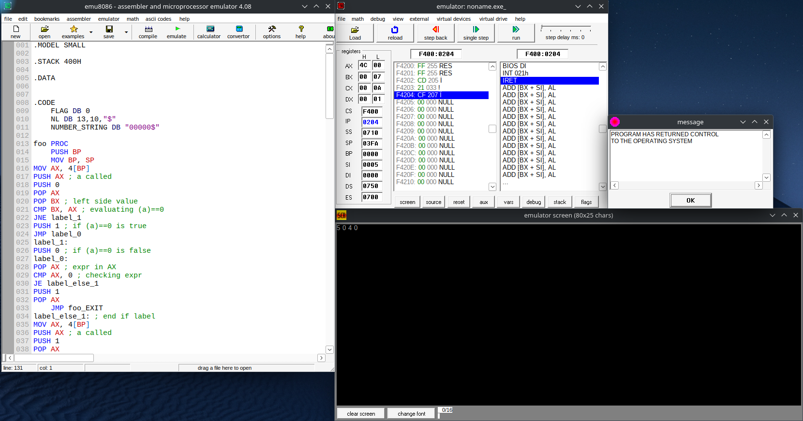

# Subset of C Compiler

## Overview
This project is a subset of a C compiler developed using **Flex** (Lexical Analyzer) and **Bison** (Parser Generator). The compiler supports essential C functionalities such as loops, branching (`if-else`), functions, integer arrays, and recursion. The compiler parses the subset of C code and translates it into either executable machine code or an intermediate representation.

---

## Features
- **Control Flow**: Supports loops (`for`, `while`) and branching (`if-else`).
- **Functions**: Includes support for user-defined functions.
- **Arrays**: Handles integer arrays.
- **Recursion**: Fully supports recursive function calls.
- **Intermediate Code Generation**: Outputs intermediate representations of code.
- **Machine Code Generation**: Translates code into 8086 assembly.

---

## Project Structure
The repository is organized as follows:

### 1. Symbol Table
- This folder handles the **management of scopes** and **symbol tables** for variables and functions.
- Compile and run `1905077_main.cpp` to demonstrate symbol table generation and scope handling.

### 2. Lexical Analyzer
- This folder contains the **lexical analysis** implementation using **Flex**.
- The lexer reads the input C code and generates tokens for further processing.
- Execute `run.sh` to generate tokens from the input file.

### 3. Syntax and Semantic Analyzer
- This folder implements the **syntax analysis** using **Bison** and semantic checks for valid C code.
- It generates a **parse tree** and performs error checking.
- Execute `run.sh` to parse and analyze the input file.

### 4. Intermediate Code Generation
- This folder generates **intermediate representations** or **assembly code** for the input C code.
- Outputs can be optimized further and translated into executable formats.
- Execute `run.sh` to generate the intermediate or optimized assembly code.

---

## Requirements
- **Flex**: Used for generating the lexical analyzer.
- **Bison**: Used for generating the parser.
- **GCC**: For compiling the C code and assembly.
- **8086 Emulator** (e.g., TASM or any equivalent emulator): To run generated assembly code.

---

## How to Run
1. Clone the repository:
   ```bash
   git clone https://github.com/NafiuRahman77/Compiler.git
   cd Compiler
   ```

2. Run scripts in each folder as specified:
   - **Symbol Table**: Compile and run `1905077_main.cpp`.
   - **Lexical Analyzer**: Execute `run.sh`.
   - **Syntax and Semantic Analyzer**: Execute `run.sh`.
   - **Intermediate Code Generation**: Execute `run.sh`.

---

## Example Input
```c
int foo(int a){
	if(a == 0){
		return 1;
	}
	return foo(a-1) * a;
}
 
 
int main(){
	int i,j,k;
	i = 7;
	j = 3;
 
	k = foo(i) ;
	println(k);
 
	return 0;
}
```

---

## Output of ICG
- **Parse Tree Representation**: `parse_tree.txt`
- **Generated Assembly**: `code.asm`
- **Optimized Assembly**: `optimized.asm`

## Assembly Output Demonstration




---

## References
- [Flex Documentation](https://westes.github.io/flex/manual.html)
- [Bison Documentation](https://www.gnu.org/software/bison/)

